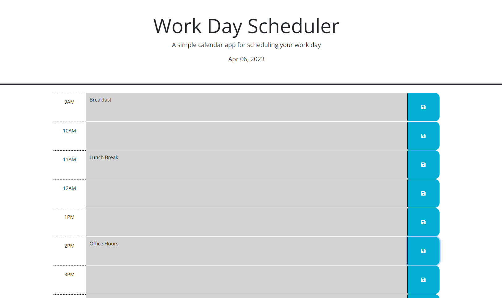

## Work Day Scheduler

URL: https://suzakijun1.github.io/Work-Day-Scheduler

## Description

A simple calendar application that allows a user to save events for each hour of the day. This app will run in the browser and feature dynamically updated HTML and CSS powered by jQuery.

The time block ranges from 9AM to 5PM.

Each time block is color coded to indicate whether the time block is in the past, present, or future.
Past = Gray
Present = Red
Future = Green

Once data has been inputted, users can save the data to local storage by clicking on the save button.

Picture:
''
